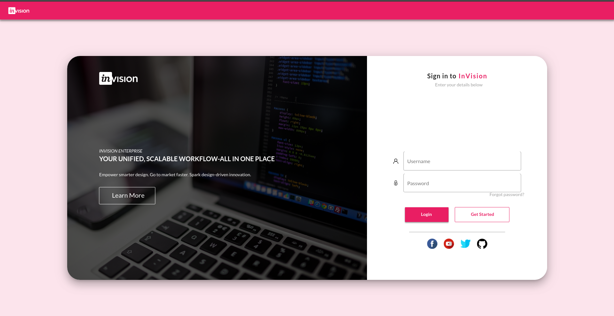

# InVision loginPage

Login page made with Flutter Web

Design Inspired By [this post](https://www.uplabs.com/posts/invision-login-page)

# Screenshot

# Requirement

To run the code you need to have Flutter web installed as well as dart SDK, and of course a code editor( eg: VsCode)

You can check Flutter web documentation [here](https://flutter.dev/web)
